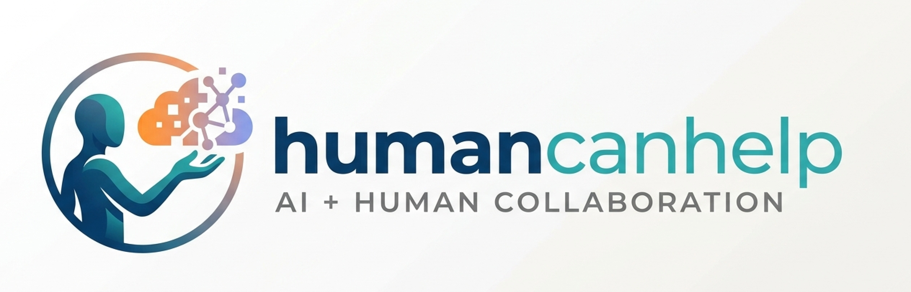

<p align="center">
  
</p>

# HumanCanHelp (HCL)

HumanCanHelp is a local human-in-the-loop handoff tool for visual or interactive tasks that AI cannot finish alone.

It starts a short-lived help session, gives you a URL, and lets a human open that page to see and interact with either:

- a live browser tab through Chrome DevTools Protocol (CDP), or
- a full desktop session through VNC.

Captcha solving is one use case, but it is not the only one. HCL is for any moment where an agent needs a real person to briefly look at a screen, click something, type something, or complete a blocked step.

No accounts, no cloud dashboard, no API keys. It runs on your machine.

## What HCL is for

HCL is useful when an automated workflow reaches a human-only step such as:

- CAPTCHA and human verification challenges
- slider, click, or visual puzzle flows
- browser steps that require a human eye or judgment
- “please look at this screen and finish this step” handoffs
- remote help during Playwright or Puppeteer sessions
- desktop-only interactions when browser-tab sharing is not enough

The core model is simple:

1. Start HCL locally.
2. HCL prints a local URL, and optionally a public URL.
3. A human opens the page and sees the shared browser tab or desktop.
4. The human interacts directly.
5. The human clicks **Done** or **Cannot solve**.
6. Your CLI exits with success or failure.

## Current status

This project currently runs from a local checkout.

```bash
npm install
npm run build
node dist/index.js start
```

The package metadata and CLI names are already in place, but this README should treat the local checkout flow as the real installation path for now.

## How it works

HumanCanHelp supports two session modes.

### 1. CDP mode: share a browser tab

If Chrome or another Chromium-based browser is running with remote debugging enabled, HCL can connect through CDP and share a live browser tab.

This is the recommended mode for:

- browser automation recovery
- CAPTCHA or verification inside a web page
- short human intervention during Playwright or Puppeteer runs

In CDP mode, the helper can:

- see the live page
- click
- type
- drag sliders

### 2. VNC mode: share a full desktop

If CDP is unavailable, HCL can connect to a VNC server and share a full desktop session instead.

This is useful when:

- the blocked step is not inside a browser tab
- you need access to a native desktop app
- browser-only sharing is too limited

## Quick start

### Auto-detect mode

If you do not pass `--cdp` or `--vnc`, HCL will:

1. try CDP at `localhost:9222`
2. fall back to VNC at `localhost:5900`

```bash
node dist/index.js start
```

Example output:

```text
HumanCanHelp started

Local:   http://<your-local-ip>:6080
Mode:    CDP (Chrome DevTools Protocol)
Target:  ws://localhost:9222/devtools/page/XXXX
Timeout: 600s
```

### Explicit CDP mode

Start Chrome with remote debugging enabled:

```bash
chrome --remote-debugging-port=9222
```

Then start HCL:

```bash
node dist/index.js start --cdp localhost:9222
```

### Explicit VNC mode

```bash
node dist/index.js start --vnc localhost:5900
```

Example output:

```text
HumanCanHelp started

Local:   http://<your-local-ip>:6080
Mode:    VNC
VNC:     localhost:5900
Timeout: 600s
```

### Remote helper mode

If the helper is not on the same network, you can ask HCL to create a public tunnel URL.

Install the optional tunnel dependency first:

```bash
npm install localtunnel
```

```bash
node dist/index.js start --public --password mysecret
```

Example output:

```text
HumanCanHelp started

Local:    http://<your-local-ip>:6080
Public:   https://abc123.lhr.life
Mode:     CDP (Chrome DevTools Protocol)
Timeout:  600s
Password: yes
```

## Session lifecycle

When a helper opens the page, HCL serves a live interaction UI.

The helper can:

- interact with the shared screen or tab
- click **Done** when the task is complete
- click **Cannot solve** if they cannot finish it

Session behavior:

- **Done** → CLI exits with success
- **Cannot solve** → CLI exits with failure
- **Timeout** → session expires, the page shows an expired state, and HCL starts a fresh session with the same config

## CLI reference

### Commands

```bash
node dist/index.js start [options]
node dist/index.js stop
node dist/index.js status
```

### Options

| Option | Default | Description |
|---|---|---|
| `--port` | `6080` | HTTP port for the helper page |
| `--cdp` | auto | CDP endpoint, for example `localhost:9222` |
| `--vnc` | auto | VNC endpoint, for example `localhost:5900` |
| `--timeout` | `600` | Auto-stop / session-expiry time in seconds |
| `--public` | off | Create a public tunnel URL for remote helpers |
| `--password` | none | Require a password before the helper can access the session |
| `--mask` | none | Accepts mask regions like `x,y,w,h;x,y,w,h` |

### Status

`status` reports whether a server is running, which mode it is in, and whether a public URL exists.

### Stop

`stop` shuts down the running local HCL server on the selected port.

## Privacy and security notes

What exists today:

- local-first workflow
- optional password protection
- optional public tunnel only when explicitly requested and the optional `localtunnel` package is installed

Important limitation:

- `--mask` exists in the CLI surface, but masking is **not enforced yet** in the current MVP. Do not rely on it as a real privacy control.

So the honest current privacy story is:

- password protection works
- sharing is opt-in
- public tunnel support is optional and currently depends on a separately installed tunnel package
- masking is not production-ready yet

## VNC setup

### macOS

System Settings → General → Sharing → Screen Sharing → enable

### Linux

```bash
sudo apt install x11vnc
x11vnc -display :0 -forever
```

### Windows

Install [TightVNC](https://www.tightvnc.com/) or UltraVNC.

## What HCL does not claim yet

The current codebase is intentionally small and local.

It does **not** currently claim to be:

- a hosted service
- a polished remote desktop platform
- a full MCP runtime
- a complete privacy-masking system
- a fully polished npm-published product you can install globally without caveats today

The safest way to think about HCL right now is:

> a lightweight local handoff tool for short human assistance sessions during blocked AI workflows

## Why this is broader than captchas

Captchas are a common use case because they are a clear example of “AI is blocked, a human needs to take over briefly.”

But the product itself is broader:

- it can share a browser tab
- it can share a desktop session
- it supports arbitrary clicking and typing
- it supports success / failure handoff semantics
- it works for any short visual or interactive blocker, not just verification challenges

If a workflow reaches a point where a person needs to look, decide, click, type, drag, or confirm something on a live screen, HCL is the handoff layer.

## License

MIT
